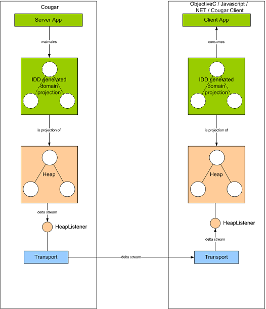

{:toc}

# Introduction to Push

The concept of push is relatively simple: to replicate a representation of your domain model from a server which may
mutate that model, to one or more clients who are interested in that model.

Where it differs from similar concepts such as events delivered over JMS is that each client makes it's own unique
subscription by making an RPC call to the server, enabling the server to decline subscription, or subscribe the client
to a variant of the desired data (perhaps providing stale updates or reduced range of data returned).

Cougar models push via a connected operation which returns a handle on a heap. This heap contains the logical object
graph that is to be replicated, which both server and client interact with via a domain projection which is generated
from an IDD. The transport replicating the delta stream that is emitted from the heap on mutation via the projection
listens to the heap, and subsequently the client side heap listens to the client end of the transport.

# Defining connected operations in BSIDL

All data types defined in your BSIDL will have both normal and connected versions generated. To define a connected
operation, just specify the `connected` attribute with a value of `true`. Depending on whether you have selected
`client` or `server` binding generation, you will get either server or client side connected objects generated
(or both), as well as a common parent class.

For example (documentation elements removed for brevity):

`
<operation name="bestPrices" connected="true">
  <parameters>
    <request>
      <parameter name="marketId" type="string">
      </parameter>
    </request>
    <simpleResponse type="BestPrices"/>
  </parameters>
</operation>
.
<dataType name="BestPrices">
  <parameter name="back1" type="float"/>
  <parameter name="back2" type="float"/>
  <parameter name="back3" type="float"/>
  <parameter name="lay1" type="float"/>
  <parameter name="lay2" type="float"/>
  <parameter name="lay3" type="float"/>
</dataType>
`

{info}
Whilst no extension elements exist for push, you do need to still ensure you have defined the operation in your extensions
document. You do not, however, need to define any extension or parameter sub-elements.
{info}

This will then generate a connected operation (which has a return type of ConnectedResponse) rather than an RPC operation
in the service interface and definition.

In total, for the above snippet you would end up with the following generated code:

* Operation signature: `public ConnectedResponse bestPrices(ExecutionContext ctx, String marketId);`
* Abstract parent connected object: `BestPricesCO`
* Optional server connected object: `BestPricesServerCO`
* Optional client connected object: `BestPricesClientCO`

## Constraints

Due to the nature of push, there is one restriction with regards to connected operations, namely that you cannot have a
response type of `void`.

# Working with connected objects

This will vary depending on whether you are implementing a client or service:

* [Cougar Push Server](Cougar_Push_Server.html)
* [Cougar Push Client](Cougar_Push_Client.html)

# Transports

Currently connected operations/objects are only supported on the in-process and socket transports. There are no plans at
this time to provide implementation on other transports.

# Performance characteristics

See the socket transport [performance characteristics](Cougar_Socket_Performance_Characteristics.html)
